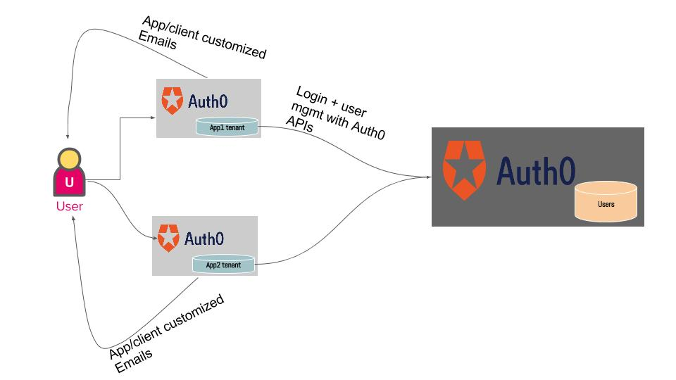

# lmrk-scripts

Auth0 customs scripts to enable multiple auth0 `tenants` to use a `centralized tenant` for their user management. This mode is similar to connecting `auth0-auth0` using federation with WSFederation or SAML protocol.

This model can be used to support per application email customizations as all user management is proxied through  application tenants. 

Structure the repo as per instructions [here](https://auth0.com/docs/extensions/github-deploy#deployment) and you can use auth0 git deploy extension to deploy these scripts... 
